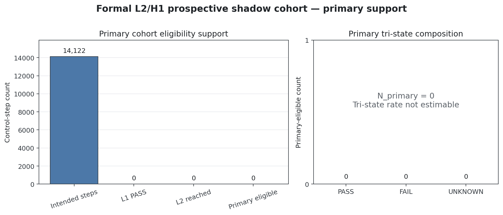
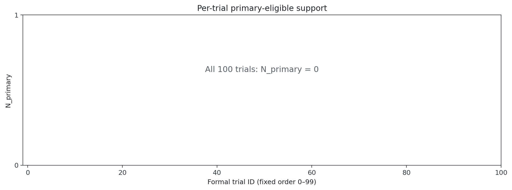

# Report: Analyze L2/H1 Prospective Shadow Cohort V1

## Section A — Primary result

The formal cohort contained 14,122 intended control steps and 14,122 uniquely joined formal rows across 100 trials. None satisfied all ten pre-registered primary eligibility conditions, so `N_primary=0`. Within that empty primary cohort, PASS/FAIL/UNKNOWN counts are 0/0/0 and the tri-state algebra is exact.

The primary FAIL rate, UNKNOWN rate, and known-status sensitivity are all `NOT_ESTIMABLE`; zero divided by an empty primary denominator is not reported as a zero rate. The trial-cluster bootstrap used the frozen 100-trial resampling contract, seed 20260831, and maximum 100,000 draws. It produced 0 valid replicates and 100,000 zero-denominator draws, so the 95% CI is also `NOT_ESTIMABLE`.

## Section B — Primary interpretation

The primary result is `CASE_C_PRIMARY_NOT_ESTIMABLE`. The formal collection was complete and join-valid, but the frozen controller produced no selected control that simultaneously had frozen shadow L1 `PASS`, explicit L2 reachability, and a typed L2 result. Therefore this cohort cannot estimate the prevalence of candidate-dependent future-segment L2/H1 signals or the incremental information after L1 PASS.

The audit reason counts are 14,122 each for unmet `l1_status_pass`, `l2_reached`, and `l2_typed`; these counts diagnose eligibility support and do not redefine the cohort. Because the six logging-completeness rates are all 1.0, this is not attributed to missing `u_k`, map authority, reachability logging, shadow-result logging, capture, or join failure.

## Section C — Per-trial heterogeneity

All 100 trials have `N_primary=0`. Consequently, the per-trial primary-rate median, IQR, minimum, and maximum are not estimable. Zero trials contain at least one primary-eligible FAIL and zero contain at least one primary-eligible UNKNOWN; these zeros mean no eligible endpoint existed, not that every trial was certified safe.

## Section D — Secondary endpoints

- L2 selected reach rate: 0 / 14,122 = 0.0.
- Capture, selected-u, map-authority, reachability, shadow-result, and join completeness: 1.0 each.
- Backend usage: empty because no primary-eligible L2 evaluation exists.
- Native multi-candidate groups: 0; analysis status `MULTI_CANDIDATE_ANALYSIS_NOT_ESTIMABLE`.
- Synthetic candidate generation: 0; `u_des` is not treated as a native alternative.
- Selected versus native non-selected: `NOT_ESTIMABLE_NO_EVALUATED_NATIVE_NONSELECTED`.
- No p-value or step-iid inference was computed.

## Section E — Evidence boundary

This was shadow-only observation with no controller authority, candidate replacement, intervention, or feedback. Collision, progress, and termination data were not analyzed scientifically. The evidence does not support collision prevention, safety improvement, controller efficacy, intervention success, recursive feasibility, safe stopping, a physical-world guarantee, a real-time guarantee, deployment readiness, Core V2 superiority, or a counterfactual avoided-collision claim.

The maximum supported claim is narrower: the frozen prospective cohort was complete and join-valid, but no selected control reached the pre-registered primary L1-PASS/L2-evaluated cohort; therefore primary signal prevalence and uncertainty are not estimable.

## Section F — Decision

- Selected case: `CASE_C_PRIMARY_NOT_ESTIMABLE`
- Scientific decision: `PRIMARY_OPERATIONAL_OPPORTUNITY_NOT_ESTIMABLE`
- Only next task: `DIAGNOSE_L2_H1_PRIMARY_REACHABILITY_V1`

That next task must diagnose the frozen reachability path without changing this V1 denominator, protocol, controller, certifier, map, result commitments, or formal artifacts. No downstream recovery, L3/L4/L5, controller intervention, threshold tuning, or trial rerun is executed here.

## Fail-closed validation blocker

The frozen validator passed 21 checks and failed only `bootstrap_contract_exact`. The frozen protocol requires zero-denominator replicates to be redrawn until either 10,000 valid replicates are obtained or 100,000 total draws are reached; if the latter occurs first, the required result is `BOOTSTRAP_NOT_ESTIMABLE`. This cohort reached the latter condition exactly: 0 valid, 100,000 total, and 100,000 zero-denominator draws.

The locked validator instead unconditionally checks `bootstrap_valid_replicates == 10000`, so it cannot validate the protocol-authorized Case C path. This is a core validator-contract bug discovered after scientific reveal. Following the frozen stop rule, the validator is not edited, the bootstrap output is not falsified, and V1 is not committed, pushed, or opened as a Draft PR. The scientific compact evidence and blocker record are preserved for explicit follow-up authorization.

## Reproducibility record

The scientific outcome remained unread until the protocol, collection lock, raw manifest, result commitment, ordered result commitment, namespace isolation, strict QC, and post-data deviation gates passed. The analysis implementation was then frozen with combined SHA-256 `08cecef117031f599167ca944ba1ac9ac78da94a908a314ecf750729073e6d59` before reveal. The canonical 14,122-row table is retained only on the server at the path and SHA recorded in `formal_analysis_table_manifest.json`; it is not copied into Git.

Two pre-reveal verifier packaging corrections addressed Windows raw-blob line endings and SSH quoting. They occurred before any scientific status was read and did not alter the frozen scientific formulas, denominator, join semantics, or results.
