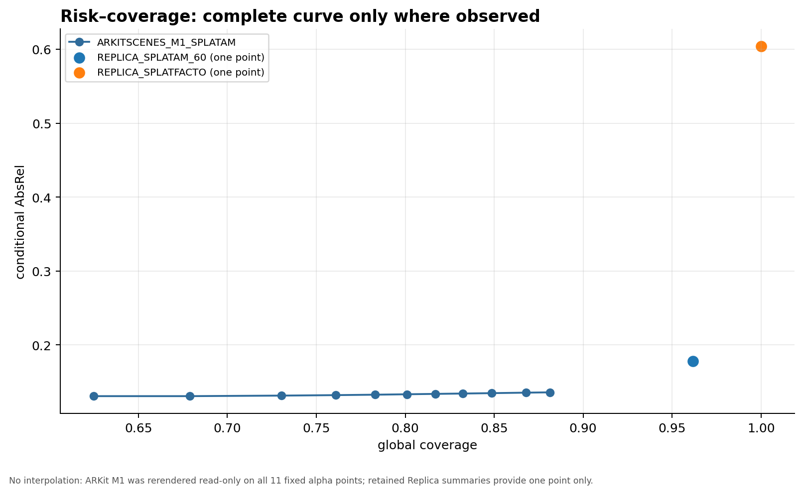
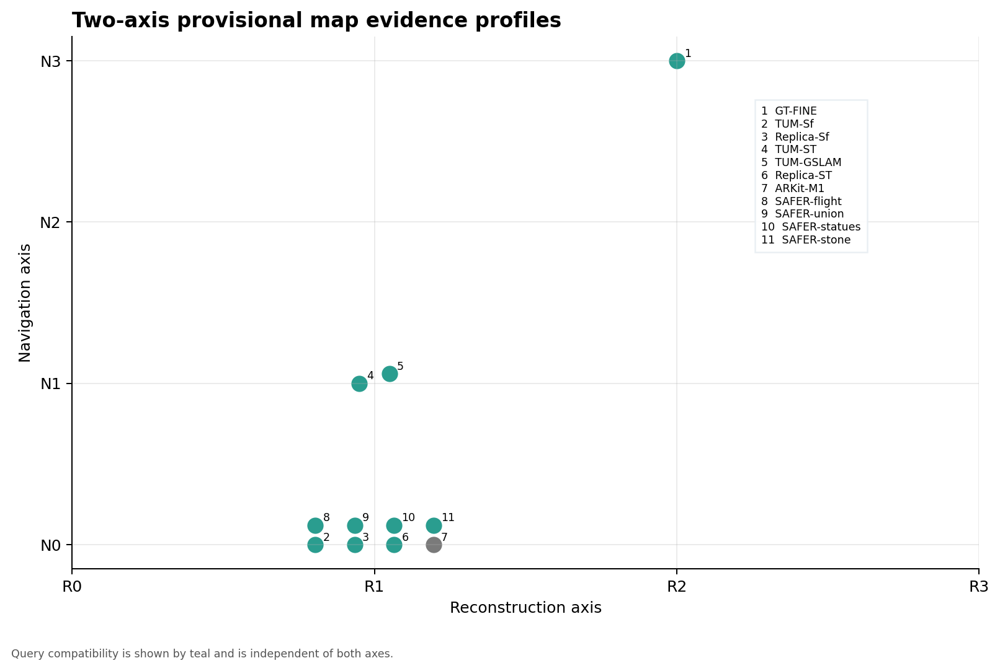

# Gaussian Map Metric Provenance and Navigation Usability Calibration V1

## Technical summary

**Result:** `PASS_GAUSSIAN_MAP_METRIC_PROVENANCE_AND_NAVIGATION_USABILITY_CALIBRATION_V1`  
**Decision:** `FREEZE_LAYERED_GAUSSIAN_MAP_EVALUATION_PROTOCOL_V2`  
**Universal numeric gate:** `NO_UNIVERSAL_NUMERIC_GATE_JUSTIFIED_BY_CURRENT_EVIDENCE`  
**Only next task:** `RETROSPECTIVE_REQUALIFY_EXISTING_GAUSSIAN_MAPS_UNDER_LAYERED_PROTOCOL_V2`

The audit found that standard metric formulas and historical numerical cutoffs came from different authorities. The formulas for AbsRel, delta accuracy and bidirectional surface reporting are standard; the project-wide use of `tau_alpha=0.5`, coverage `>=0.95`, AbsRel `<=0.20`, delta1 `>=0.75`, ratio `[0.80,1.25]`, and several clearance percentiles as universal map/navigation hard gates was not supported by theory, dataset authority, primary papers, or independent multi-map calibration. Protocol V2 therefore retains integrity gates and route-conditioned physical gates, while moving those global scalars to descriptive, warning, or future independently calibrated roles.

PR #74 remains unchanged. Its formal status is still `NO_ARKITSCENES_M1_LEARNED_GAUSSIAN_MAP_QUALIFIED_UNDER_FROZEN_CONTRACT`. V2 interprets it only as `FAILED_GLOBAL_DENSE_QUALIFICATION_UNDER_LEGACY_UNCALIBRATED_COVERAGE_GATE`; ARKitScenes M1 navigation usability remains `NOT_YET_DETERMINED_UNDER_PROTOCOL_V2`.

## Key evidence

- Historical scan: **1906** tracked reproduction files, **139** commits, **110** reports and **482** threshold-bearing ledger rows across **20** normalized metric/contract names.
- Provenance: formula-source counts `{'PAPER_OR_BENCHMARK_METRIC_DEFINITION': 46, 'PROJECT_DEFINED_METRIC': 346, 'THEORY_DEFINITION': 28, 'OFFICIAL_CODE_SEMANTICS': 62}`; threshold-source counts `{'PROJECT_HEURISTIC': 233, 'SOFTWARE_NUMERICAL_TOLERANCE': 169, 'RESOURCE_BUDGET': 8, 'UNDOCUMENTED_OR_UNRESOLVED': 44, 'PHYSICAL_CONTRACT_DERIVED': 28}`; decision-role counts `{'LEGACY_UNCALIBRATED_HARD_GATE': 221, 'INTEGRITY_HARD_GATE': 169, 'DIAGNOSTIC_WARNING': 56, 'RESOURCE_EXECUTION_GATE': 8, 'PHYSICAL_SAFETY_HARD_GATE': 28}`. There are **44** unresolved rows and **19** metrics with multiple numeric/comparator variants. These counts include scientific, numerical-tolerance, resource and scheduling contracts; the ledger preserves source line and first-commit evidence rather than silently discarding operational thresholds.
- Primary authority: **20** original papers, official repositories/docs, dataset pages and benchmark definitions; no secondary blog/forum authority. None establishes the historical global scalar values as universal navigation-safety gates.
- Map inventory: **11** map/interface records; currently accessible at audited paths: **6** (`REPLICA_GT_FINE, REPLICA_SPLATFACTO, TUM_SPLATAM_FORMAL, TUM_GAUSSIAN_SLAM, REPLICA_SPLATAM_60, ARKITSCENES_M1_SPLATAM`); unavailable and explicitly not retrained: **5** (`TUM_SPLATFACTO_NEGATIVE, SAFER_OFFICIAL_FLIGHT, SAFER_OFFICIAL_OLD_UNION2, SAFER_OFFICIAL_STATUES, SAFER_OFFICIAL_STONEHENGE`).
- Read-only ARKit M1 fixed-grid rerender: all **11** frozen alpha points completed. Coverage changes from `0.881245246` at alpha `0.05` to `0.624873865` at alpha `0.95`; conditional AbsRel changes from `0.135755117` to `0.130600208`. Descriptive AURC is `0.033918351938` over the observed coverage interval. The params SHA is identical before and after (`86ba75c9db0fab1a5eb7d65da82454514419a30d7bea6df68b2bbc0518000193`), so map modification count is zero.
- ARKit M1's retained alpha `0.5` point is reproduced exactly at coverage `0.800998572`, AbsRel `0.133145676`, delta1 `0.811134506`, ratio `0.963813007`. Its observable missing fraction is `0.199001428`, but retained summaries do not contain binary masks/routes needed to assert wall gaps, robot-height gaps, or route-tube intersections.
- Replica SplaTAM remains `LEGACY_SINGLE_THRESHOLD_BORDERLINE`: coverage `0.961643545`, AbsRel `0.178093402`, delta1 `0.743966766`, ratio `0.941397548`; it missed the project delta1 cutoff by about `0.00603`. This does not restore PASS and does not establish navigation usability.
- Multi-tolerance bidirectional distance arrays were not retained for the learned candidates. No curve was fabricated. Replica GT-FINE's exact mesh-support certificate is preserved, but it is not relabelled as an ETH3D-style accuracy/completeness curve.

## Scope, definitions and method

The accepted set is `K_tau = {target pixel | accumulated renderer alpha >= tau, predicted depth finite and positive}`. Global coverage is `|K_tau|/|target|`. Depth errors are conditional on `K_tau`; rejected support is UNKNOWN, not FREE. Dangerous one-sided distance error is `e_plus=max(0,d_map-d_ref)`.

The audit scanned the frozen PR #74 lineage plus all available refs at the frozen checkout, recorded SHA-256 identities for tracked inputs, reconciled the required map list with server paths, and assigned the mandated source enums. Primary-source claims were checked only against original papers, official code/docs and dataset/benchmark authorities, including [3DGS](https://arxiv.org/abs/2308.04079), [SplaTAM](https://arxiv.org/abs/2312.02126), [TUM RGB-D](https://cvg.cit.tum.de/data/datasets/rgbd-dataset), [Replica](https://github.com/facebookresearch/Replica-Dataset), [ARKitScenes DATA](https://github.com/apple/ARKitScenes/blob/main/DATA.md), [ETH3D](https://eth3d.ethz.ch/high_res_multi_view?metric=f1-score&set=test&sortby=g1&tolerance_id=2), [SAFER-Splat](https://arxiv.org/abs/2409.09868), [OctoMap](https://octomap.github.io/octomap/doc/index), selective prediction and sampled-data CBF papers.

Read-only diagnostics used retained per-frame evidence and, for ARKit M1, one fresh immutable render pass per held-out frame. The predicted depth/alpha from that pass was reused at all fixed alpha values; no map-specific threshold, interpolation, filtering, optimizer or controller was used.

## Required audit questions

1. **Historical flow:** Mapping, frozen global gates, static query checks and later navigation experiments were historically coupled. V2 separates provenance, reconstruction, unknown-aware physical usability and query compatibility.
2. **Formula sources:** Standard depth/image/geometry formulas come from papers or benchmark definitions; renderer and query semantics come from official code; coverage, missing-cluster and several integration measures are project-defined.
3. **Threshold sources:** The ledger distinguishes theory, physical contracts, dataset/benchmark reporting, empirical calibration, project heuristics, resource budgets, numerical tolerances and unresolved values.
4. **Theory/official content:** Units, poses, confidence labels, metric formulas, occupancy-state distinctions and sampled-data safety structure are authoritative. Historical project cutoffs are not.
5. **Subjective project values:** Alpha `0.5`, global coverage `0.95`, AbsRel `0.20`, delta1 `0.75`, ratio range, several percentile/cluster/G0 counts and route-support cutoffs are project heuristics unless a row records narrower physical provenance.
6. **Version changes:** `19` normalized metrics have more than one numeric/comparator variant in tracked history.
7. **Uncalibrated changes:** Project-heuristic/unresolved variants are marked `changed_without_calibration`; they cannot silently propagate into V2.
8. **Downgraded old hard gates:** Global coverage, alpha, conditional depth/image scalars, Gaussian count, AURC and single runtime are not universal navigation gates.
9. **Retained hard gates:** Identity, split non-leakage, units/pose/intrinsics, finite outputs, deterministic export, immutability, exact numerical engine, independent-oracle identity, no unauthorized post-processing, UNKNOWN-not-FREE, collision-free reference tube and physical budget/dynamics conditions.
10. **Coverage 0.95 / alpha 0.5:** Both are legacy project working points, not universal probabilities or safety thresholds. The new ARKit curve demonstrates the risk-coverage trade-off.
11. **AbsRel 0.20 / delta1 0.75:** The formulas are standard; these qualification cutoffs are legacy uncalibrated hard gates and become descriptive/warning inputs pending independent calibration.
12. **Point-to-mesh:** Direction, sampling, support and reference authority must be explicit. Symmetric proximity alone does not detect dangerous free-space overestimation.
13. **Clearance:** Use one-sided `e_plus` and a route-conditioned upper bound. Historical p95/p99/max values are not universal certificates; empirical p99 remains an empirical percentile.
14. **G0:** It can prove static query/interface/numerical compatibility only. It neither proves navigation nor makes a geometry failure automatically causal.
15. **Route/group/frame gates:** They are domain/aggregation contracts. Route criteria become hard only when derived from a frozen swept body, reference, dynamics and physical allowances.
16. **Data split gates:** TRAIN/HELDOUT identity and no leakage remain integrity hard gates.
17. **Seed/statistics:** Single seed supports one map instance. Future uncertainty clusters by frame/group/route/map, not pixels, and reports spatial autocorrelation and domain shift.
18. **Reference geometry:** Replica dense mesh is authority A. Held-out RGB-D/LiDAR is observable-ray authority B. Official SAFER examples without independent reference are interface authority C.
19. **Native/common renderer:** Both channels are recorded; channel availability is not parity and favorable selection is forbidden. Fresh numeric parity is missing for several maps and is a requalification item, not a reason to choose one channel.
20. **Unknown:** Rejected support is never free. Occupied is conservative; high-cost is only diagnostic until a planner contract is frozen.
21. **Early stop:** Qualification may stop, but read-only attribution diagnostics should continue when safe and necessary.
22. **Historical artifacts:** `6` of `11` audited paths are accessible. Every unavailable map is `ARTIFACT_UNAVAILABLE_FOR_RETROSPECTIVE_EVALUATION`; none was retrained.
23. **Risk–coverage:** ARKit M1 has a complete fixed-grid curve; Replica retained summaries remain single points and are not called curves. AURC is descriptive.
24. **Multi-tolerance:** No learned-map bidirectional sample set supports a complete fixed-tolerance curve in retained compact evidence; outputs explicitly record `NOT_EVALUABLE` instead of inventing values.
25. **Navigation-conditioned evaluability:** Only the historical Replica GT-FINE positive-control contract has independent geometry, robot and route identities together. No new controller or navigation conclusion was produced.
26. **Two-axis profiles:** Provisional R/N labels and separate `SAFETY_QUERY_COMPATIBLE` flags are in `calibration/provisional_evidence_profiles.json`; no new PASS was granted.
27. **Universal numeric gate:** `NO_UNIVERSAL_NUMERIC_GATE_JUSTIFIED_BY_CURRENT_EVIDENCE` because the independent control set is too small and candidates cannot calibrate themselves.
28. **Protocol V2:** Frozen at SHA-256 `a0a02fd284c75c600095510899e2878f198d69ff088b66eccd3313275fdbde7e` with provenance, risk-coverage, unknown, multi-tolerance, one-sided physical budget, route tube, two axes, uncertainty and claim boundaries.
29. **ETH3D:** Still paused. Its V2 entry checklist must be complete before any formal training.
30. **Old PR boundary:** PRs #68-#74 and their files/statuses remain unchanged; this task adds one continuation branch/PR only.
31. **FINAL_STATUS:** `PASS_GAUSSIAN_MAP_METRIC_PROVENANCE_AND_NAVIGATION_USABILITY_CALIBRATION_V1`.
32. **FINAL_DECISION:** `FREEZE_LAYERED_GAUSSIAN_MAP_EVALUATION_PROTOCOL_V2`.
33. **Only next task:** `RETROSPECTIVE_REQUALIFY_EXISTING_GAUSSIAN_MAPS_UNDER_LAYERED_PROTOCOL_V2`.

## Limitations and uncertainty

The historical corpus is heterogeneous and operational scripts sometimes place multiple numeric contracts on one line. The ledger therefore preserves source-line context and treats ambiguous extractions as unresolved rather than asserting scientific meaning. Several map artifacts or common-renderer channels are unavailable at the audited path. Only ARKit M1 supported a complete fixed-alpha rerender in this task; other maps retain single working points. Binary support masks, bidirectional distance samples and legal learned-map route registries were not retained broadly enough for full spatial-component, fixed-tolerance or navigation requalification. These are map-specific evidence gaps, not task-level blockers.

The positive/negative control pool spans too few independent maps and datasets for leave-one-map-out or leave-one-dataset-out calibration. Per-pixel sample counts must not be treated as independent statistical replication. The output is a protocol and evidence inventory, not a new map qualification.

## Recommendations and handoff

Run the one authorized next task in control-first order. Recompute only missing diagnostics from immutable artifacts, never retrain to recover a missing audit artifact, and freeze legal routes/robot budgets before navigation claims. Keep ETH3D paused until the new-dataset checklist passes.

Protocol V2: `protocol_v2/GAUSSIAN_MAP_LAYERED_EVALUATION_PROTOCOL_V2.md`  
Checklist SHA-256: `7c95f787fd7fb503e4bd2726546debac53acd41c1d5f9a8dd08c29cb27735593`  
Server report target: `/disk1/zlab/maintenance_records/gaussian_map_metric_provenance_navigation_usability_calibration_v1/report/REPORT_GAUSSIAN_MAP_METRIC_PROVENANCE_AND_NAVIGATION_USABILITY_CALIBRATION_V1.md`
