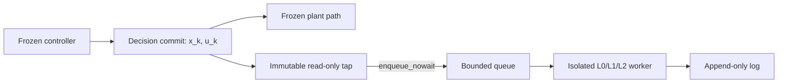
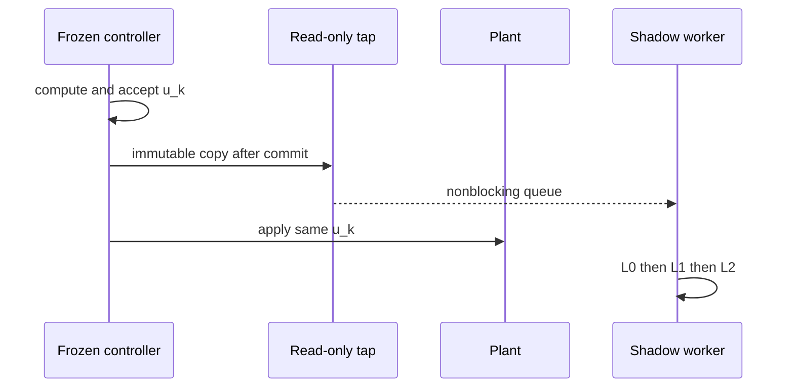
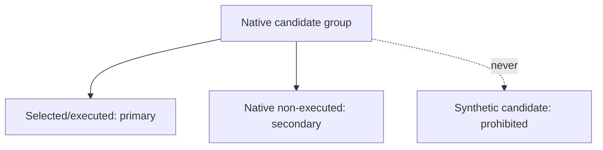
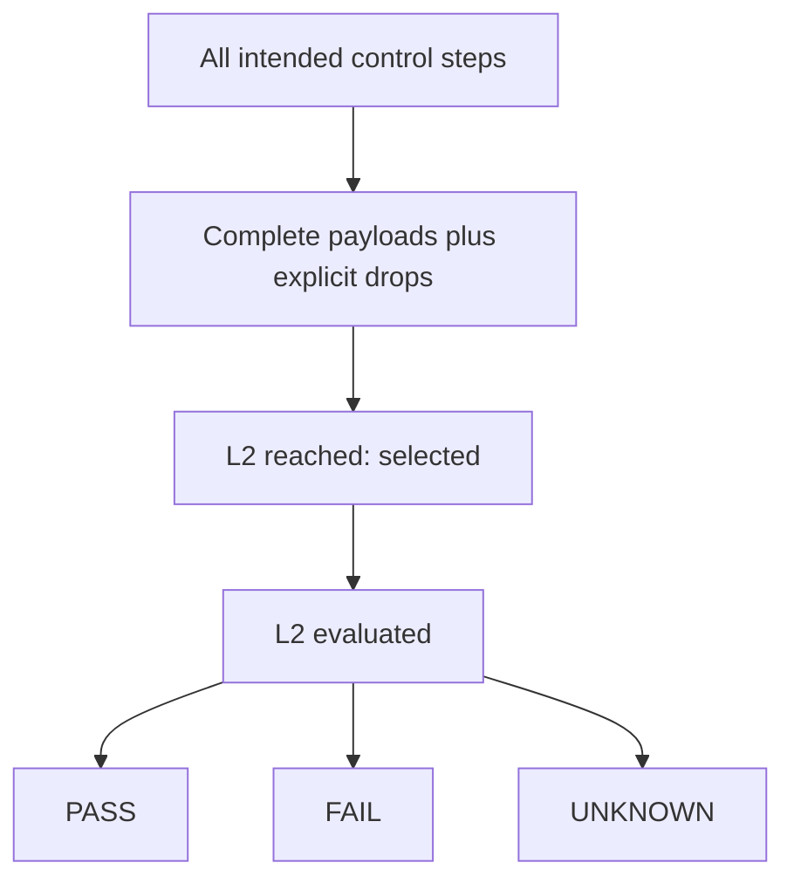
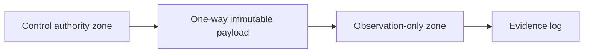
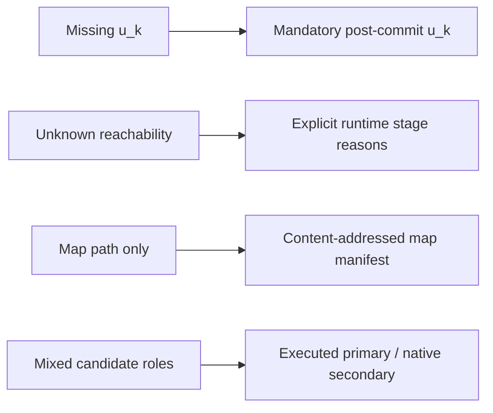
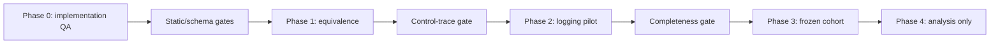

# Design Figure Specifications

Every figure carries: **DESIGN ONLY | NO ON-POLICY COLLECTION | NO CONTROLLER AUTHORITY | NO DECISION FEEDBACK | NO PERFORMANCE CLAIM**.

## 1. On-policy shadow dataflow

## 2. Control-cycle observation timing

## 3. Executed versus native candidate schema

## 4. Prospective denominator funnel

## 5. Zero-authority boundary

## 6. Frozen replay gaps to fixes

## 7. Future phase gates

